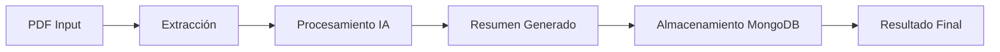

<div align="center">

# 📄✨ PDF-ExtractExt

### Herramienta Inteligente para Extracción y Resumen de PDFs

[](https://python.org)
[](https://github.com/astral-sh/uv)
[](https://mongodb.com)
[](https://en.wikipedia.org/wiki/Test-driven_development)
[](LICENSE)

<p align="center">
  
</p>

**Extrae texto de archivos PDF y genera resúmenes inteligentes utilizando modelos de Inteligencia Artificial.**

</div>

---

## 📋 Tabla de Contenidos

- [Descripción](#-descripción)
- [Características](#-características)
- [Arquitectura](#-arquitectura)
- [Tecnologías](#-tecnologías)
- [Requisitos](#-requisitos)
- [Instalación](#-instalación)
- [Configuración](#-configuración)
- [Uso](#-uso)
- [Testing](#-testing)
- [Metodologías](#-metodologías)
- [Principios de Programación](#-principios-de-programación)
- [Estructura del Proyecto](#-estructura-del-proyecto)
- [Contribución](#-contribución)
- [Licencia](#-licencia)

---

## 📝 Descripción

**PDF-ExtractExt** es una aplicación de línea de comandos desarrollada en Python que permite:

1. 📥 **Extraer texto** de archivos PDF de forma precisa
2. 🤖 **Generar resúmenes** utilizando modelos de IA (Ollama local o Moonshot AI)
3. 💾 **Almacenar resultados** en una base de datos MongoDB NoSQL

El proyecto está diseñado siguiendo las mejores prácticas de desarrollo de software, incluyendo **TDD**, **12 Factor App** y principios **SOLID**.

---

## ✨ Características

| Característica | Descripción |
|---------------|-------------|
| 🔍 **Extracción de Texto** | Extracción robusta de contenido textual de documentos PDF |
| 🤖 **IA Dual** | Soporte para Ollama (local) y Moonshot AI (Kimi K2.5) |
| 💾 **Persistencia** | Almacenamiento automático en MongoDB |
| ⚙️ **Configurable** | Configuración completa mediante variables de entorno |
| 🧪 **Testeado** | Cobertura completa con pruebas unitarias (TDD) |
| 📦 **Moderno** | Gestión de dependencias con UV |
| 🏗️ **Arquitectura Limpia** | Código modular basado en abstracciones e inyección de dependencias |

---

## 🏛️ Arquitectura

```
┌─────────────────────────────────────────────────────────────┐
│                    PDF-ExtractExt                           │
├─────────────────────────────────────────────────────────────┤
│                                                             │
│  ┌──────────────┐      ┌──────────────┐      ┌────────────┐ │
│  │  PDFExtractor│────▶│ AISummarizer │────▶ │  Database│ │ │
│  │   (Interfaz)  │     │  (Interfaz)  │      │ (Interfaz) │ │
│  └──────┬────────┘     └──────┬───────┘      └─────┬──────┘ │
│         │                     │                     │       │
│         ▼                     ▼                     ▼       │
│  ┌──────────────┐     ┌──────────────────┐  ┌─────────────┐ │
│  │PyPDFExtractor│     │OllamaSummarizer  │  │MongoDatabase│ │
│  │              │     │MoonshotSummarizer│  │             │ │
│  └──────────────┘     └──────────────────┘  └─────────────┘ │
│                                                             │
└─────────────────────────────────────────────────────────────┘
```

El diseño sigue el principio de **Inversión de Dependencias (SOLID)**, permitiendo:
- Intercambiar fácilmente implementaciones
- Realizar tests unitarios con mocks
- Extender el sistema con nuevos proveedores de IA

---

## 🛠️ Tecnologías

### Core
- **Python 3.11+** - Lenguaje de programación moderno y tipado
- **UV** - Gestor de paquetes y entornos virtuales ultra-rápido

### Extracción de PDF
- **pypdf** - Biblioteca robusta para manipulación de archivos PDF

### Inteligencia Artificial
- **Ollama** - Ejecución local de modelos LLM (Llama3, Mistral, etc.)
- **Moonshot AI (Kimi K2.5)** - API de IA avanzada en la nube

### Base de Datos
- **MongoDB** - Base de datos NoSQL documental
- **PyMongo** - Driver oficial de Python para MongoDB

### Testing & Calidad
- **pytest** - Framework de testing
- **pytest-mock** - Mocking para tests
- **ruff** - Linter y formateador ultrarrápido

### Utilidades
- **python-dotenv** - Gestión de variables de entorno (12 Factor App)
- **requests** - Cliente HTTP para APIs

---

## 📋 Requisitos

- **Python** >= 3.11
- **UV** (instalación recomendada)
- **MongoDB** (local o en la nube)
- **Ollama** (opcional, para IA local)
- **API Key de Moonshot** (opcional, para IA en la nube)

---

## 🚀 Instalación

### 1. Clonar el repositorio

```bash
git clone <url-del-repositorio>
cd pdf-extractext
```

### 2. Instalar UV (si no lo tienes)

```bash
# Windows (PowerShell)
powershell -ExecutionPolicy ByPass -c "irm https://astral.sh/uv/install.ps1 | iex"

# Linux/Mac
curl -LsSf https://astral.sh/uv/install.sh | sh
En caso de no tener curl:
wget -qO- https://astral.sh/uv/install.sh | sh
```

### 3. Crear entorno virtual e instalar dependencias

```bash
# UV creará automáticamente el entorno virtual
uv sync

# O para instalar con dependencias de desarrollo
uv pip install -e ".[dev]"
```

### 4. Configurar variables de entorno

```bash
cp .env.example .env
# Edita .env con tus configuraciones
```

---

## ⚙️ Configuración

Crea un archivo `.env` en la raíz del proyecto con las siguientes variables:

```bash
# =============================================
# CONFIGURACIÓN GENERAL
# =============================================

# Ruta al archivo PDF a procesar
PDF_FILE_PATH=documento.pdf

# =============================================
# PROVEEDOR DE IA
# =============================================

# Opciones: "ollama" | "moonshot"
AI_PROVIDER=ollama

# =============================================
# CONFIGURACIÓN OLLAMA (IA Local)
# =============================================

AI_MODEL=llama3
AI_API_URL=http://localhost:11434/api/generate

# =============================================
# CONFIGURACIÓN MOONSHOT (IA en la Nube)
# =============================================

MOONSHOT_API_KEY=your_api_key_here
MOONSHOT_MODEL=moonshotai/kimi-k2.5

# =============================================
# CONFIGURACIÓN MONGODB
# =============================================

MONGO_URI=mongodb://localhost:27017
MONGO_DB_NAME=pdf_summaries
```

---

## 🎯 Uso

### Ejecución básica

```bash
# Activar el entorno virtual
.venv\Scripts\activate  # Windows
source .venv/bin/activate  # Linux/Mac

# Ejecutar la aplicación
python main.py
```

### Ejemplo de salida

```
=== Iniciando pdf-extractext ===
[*] Proveedor de IA: moonshot
[*] Extrayendo texto de: documento.pdf
[*] Texto extraído: 15432 caracteres
[*] Generando resumen...
[*] Documento guardado con ID: 65a1b2c3d4e5f6g7h8i9j0k1

[+] Proceso completado con éxito.
[+] Resumen:
El documento trata sobre los principios fundamentales del desarrollo
software moderno, incluyendo metodologías ágiles, patrones de diseño
y mejores prácticas de codificación...
```

### Flujo de trabajo



---

## 🧪 Testing

El proyecto sigue la metodología **Test Driven Development (TDD)**.

### Ejecutar todos los tests

```bash
pytest
```

### Ejecutar tests con cobertura

```bash
pytest -v --tb=short
```

### Tests específicos

```bash
# Tests del extractor
pytest tests/test_main.py::TestPyPDFExtractor

# Tests de IA
pytest tests/test_main.py::TestOllamaSummarizer
pytest tests/test_main.py::TestMoonshotSummarizer

# Tests de base de datos
pytest tests/test_main.py::TestMongoDatabase
```

### Estructura de tests

```
tests/
├── __init__.py
├── test_main.py
│   ├── TestPyPDFExtractor      # Tests de extracción
│   ├── TestOllamaSummarizer    # Tests de Ollama
│   ├── TestMoonshotSummarizer  # Tests de Moonshot
│   ├── TestMongoDatabase       # Tests de MongoDB
│   └── TestInterfaces          # Tests de abstracciones
```

---

## 📐 Metodologías

### TDD (Test Driven Development)

Desarrollo guiado por pruebas:
1. 🔴 Escribir test que falla
2. 🟢 Implementar código mínimo para pasar
3. 🔵 Refactorizar manteniendo tests verdes

### 12 Factor App

Aplicación diseñada siguiendo los primeros 6 principios:

| Principio | Implementación |
|-----------|---------------|
| **I. Código Base** | Un repositorio git con despliegues idénticos |
| **II. Dependencias** | Declaración explícita en `pyproject.toml` |
| **III. Configuración** | Variables de entorno via `.env` |
| **IV. Backing Services** | MongoDB como recurso conectable |
| **V. Construcción vs Ejecución** | Separación clara de etapas |
| **VI. Procesos** | Aplicación stateless ejecutable |

### GitHub Flow

Gestión de proyecto con GitHub:
- Branches con nombres descriptivos
- Pull Requests para code review
- Issues para tracking de tareas

---

## 🎯 Principios de Programación

### KISS (Keep It Simple, Stupid)

> "La simplicidad es la máxima sofisticación" - Leonardo da Vinci

- Código legible y directo
- Sin optimizaciones prematuras
- Soluciones claras sobre clever code

### DRY (Don't Repeat Yourself)

- Abstracciones reutilizables
- Interfaces comunes para proveedores de IA
- Código modular y mantenible

### YAGNI (You Aren't Gonna Need It)

- Implementar solo lo necesario
- Evitar funcionalidades "por si acaso"
- Enfoque en requisitos actuales

### SOLID

| Principio | Aplicación en el proyecto |
|-----------|---------------------------|
| **S**ingle Responsibility | Cada clase tiene una única responsabilidad |
| **O**pen/Closed | Extensible vía nuevas implementaciones de interfaces |
| **L**iskov Substitution | Implementaciones intercambiables de extractor/summarizer |
| **I**nterface Segregation | Interfaces pequeñas y específicas |
| **D**ependency Inversion | Dependencia de abstracciones, no implementaciones |

---

## 📁 Estructura del Proyecto

```
pdf-extractext/
│
├── 📄 main.py                 # Punto de entrada principal
├── 📋 pyproject.toml          # Configuración del proyecto y dependencias
├── 📋 uv.lock                 # Lock de dependencias UV
├── 📝 README.md              # Este archivo
├── 📄 LICENSE                # Licencia MIT
├── 🔧 .env.example           # Plantilla de configuración
├── 🐍 .python-version        # Versión de Python requerida
│
├── 🧪 tests/                 # Tests unitarios
│   ├── __init__.py
│   └── test_main.py
│
└── 🌐 .venv/                 # Entorno virtual (no incluido en git)
    └── ...
```

---

## 🤝 Contribución

¡Las contribuciones son bienvenidas! Sigue estos pasos:

1. **Fork** el repositorio
2. Crea un **branch** para tu feature (`git checkout -b feature/nueva-funcionalidad`)
3. **Commit** tus cambios (`git commit -am 'Add: nueva funcionalidad'`)
4. **Push** al branch (`git push origin feature/nueva-funcionalidad`)
5. Abre un **Pull Request**

### Guías de estilo

- Sigue PEP 8 para código Python
- Usa **ruff** para linting y formateo
- Escribe tests para cada nueva funcionalidad
- Documenta cambios en el README si es necesario

---

## 📄 Licencia

Este proyecto está licenciado bajo la **Licencia MIT**.

```
MIT License

Copyright (c) 2024 PDF-ExtractExt Contributors

Permission is hereby granted, free of charge, to any person obtaining a copy
of this software and associated documentation files (the "Software"), to deal
in the Software without restriction, including without limitation the rights
to use, copy, modify, merge, publish, distribute, sublicense, and/or sell
copies of the Software, and to permit persons to whom the Software is
furnished to do so, subject to the following conditions:

The above copyright notice and this permission notice shall be included in all
copies or substantial portions of the Software.

THE SOFTWARE IS PROVIDED "AS IS", WITHOUT WARRANTY OF ANY KIND, EXPRESS OR
IMPLIED, INCLUDING BUT NOT LIMITED TO THE WARRANTIES OF MERCHANTABILITY,
FITNESS FOR A PARTICULAR PURPOSE AND NONINFRINGEMENT...
```

---

<div align="center">

### 💫 Desarrollado con pasión y buenas prácticas

**[⬆ Volver arriba](#-pdf-extractext)**

</div>
